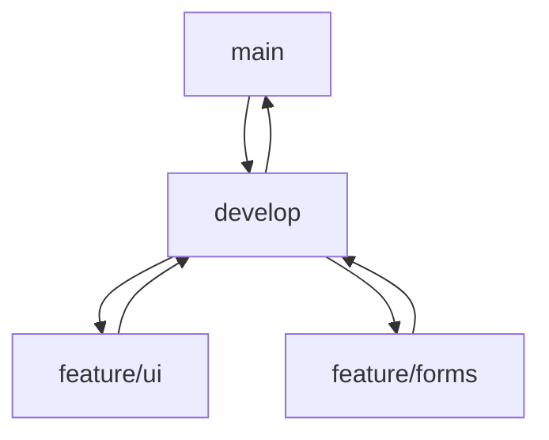

# Neiro — сайт сервиса по сборке и апгрейду ПК

Статический многостраничный сайт (HTML/CSS/JS) для демонстрации услуг сборки, апгрейда и диагностики компьютеров.

## Демо и репозиторий
- Репозиторий: https://github.com/xem1zo/Neiro
- GitHub Pages (после включения Pages на ветке `main`): https://xem1zo.github.io/Neiro/

## Стек
- HTML5, CSS3 (Flex/Grid, адаптив), JS (минимальный интерактив)
- Без сборки и зависимостей — всё работает прямо из репозитория

## Структура
- `index.html` — главная
- `about.html` — о команде
- `services.html` — услуги
- `pricing.html` — тарифы
- `cases.html` — портфолио
- `contacts.html` — контакты и форма заявки
- `assets/css/style.css` — стили
- `assets/js/main.js` — небольшой интерактив (бургер-меню, плавный скролл)
- `assets/img/` — логотип и заглушки под изображения

## Как запустить локально
```bash
git clone https://github.com/xem1zo/Neiro.git
cd Neiro
# Открыть любой HTML в браузере (двойной клик или через Live Server)
```

## Ветки (пример)
- `main` — стабильная версия (деплой на Pages)
- `develop` — активная разработка
- `feature/*` — новые блоки/страницы (по желанию)

## Диаграмма ветвления (Mermaid)


## Чеклист перед публикацией
- [ ] Ветка `main` содержит актуальную версию
- [ ] GitHub Pages включён: Settings → Pages → Deploy from branch (`main`)
- [ ] Навигация между страницами работает
- [ ] Контактная форма заполнена валидными атрибутами (`required`, `type="email"`)
- [ ] Изображения и ссылки не ведут на 404

## Авторы
Команда учебного проекта по верстке и фронтенду:
--